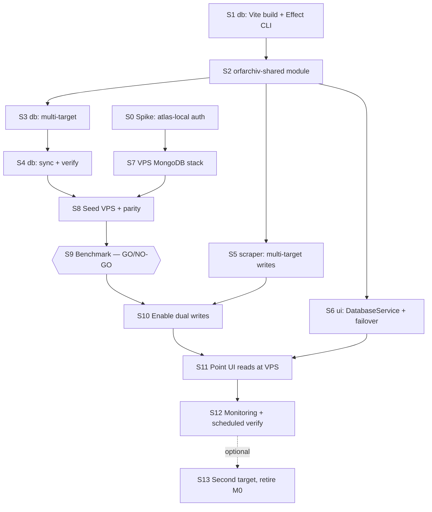

# Epic: self-hosted MongoDB as a first-class database target

## Goal

Run MongoDB on a self-hosted VPS as the **primary** database for ORF Archiv, keep the Atlas M0 free
tier as a **fallback**, and make the *number* of databases a configuration detail rather than a
hard-coded assumption.

After this epic:

- The scraper writes every story to **N configured databases**.
- The backup job pulls from **N configured databases**.
- The UI reads with **ordered failover** across **N configured databases**.
- Nothing in the code knows that "target #2 happens to be M0" — so M0 can be swapped for a second
  self-hosted instance, or dropped entirely, by changing one environment variable.

## Why now

| Fact | Consequence |
| --- | --- |
| The `news` collection holds **436,710 documents** | ~104 MB of JSON *excluding* embeddings |
| Plus 256-dim quantized `titleEmbedding` values and six indexes | Real footprint is **300–500 MB** |
| Atlas M0's storage ceiling is **512 MB** | The current database is close to a hard wall |
| M0 is a shared, throttled tenant | Query latency is capped by noisy-neighbour effects, not by the data |

The target VPS is **4 vCPU / 8 GB RAM / 80 GB disk in Frankfurt**. The entire working set fits in
RAM with room to spare, so the self-hosted instance should be substantially faster than M0 — but
that is measured before any read traffic moves (story **S9**).

## Architecture

```
                    ORFARCHIV_DB_URLS  (ordered, highest priority first)
                              │
        ┌─────────────────────┼─────────────────────┐
        │                     │                     │
   ┌────▼─────┐         ┌─────▼──────┐       ┌──────▼──────┐
   │ scraper  │         │ db backup  │       │  ui (Vercel)│
   │ writes   │         │ pulls      │       │ reads with  │
   │ to ALL   │         │ from ALL   │       │  failover   │
   └────┬─────┘         └─────┬──────┘       └──────┬──────┘
        │                     │                     │
        └──────────┬──────────┴──────────┬──────────┘
                   │                     │
          ┌────────▼────────┐   ┌────────▼────────┐
          │  VPS Frankfurt  │   │   Atlas M0      │
          │  atlas-local    │   │   (fallback)    │
          │  TLS + SCRAM    │   │                 │
          └─────────────────┘   └─────────────────┘
```

Each target is an **independent** database, not a replica. They are kept in agreement by the
scraper writing to all of them, and drift is detected by `db verify` and repaired by `db sync`.

### Why not a replica set

`mongodb/mongodb-atlas-local` is a **single-node** replica set with a bundled `mongot` (the process
that serves Atlas Search and `$vectorSearch`). There is no supported way to make it multi-node, and
self-hosted Atlas Search is not available on plain community `mongod`. Since the app depends on
`$vectorSearch` for semantic search, a conventional replica set is not an option.

The N-target design delivers the same practical benefit — lose one database, keep serving — while
also satisfying the "keep M0 up to date as a fallback" requirement with the same mechanism.

## Locked decisions

| Topic | Decision | Rationale |
| --- | --- | --- |
| UI hosting | Stays on Vercel; the VPS database is internet-facing, protected by TLS + SCRAM | Vercel has no static egress IPs outside Enterprise Secure Compute, so IP allowlisting is impossible. TLS + SCRAM-SHA-256 is exactly what Atlas itself exposes |
| Redundancy | N independent targets, no replica set | See above |
| Config contract | `ORFARCHIV_DB_URLS`, ordered, **newline- or `;`-separated** | **Never comma** — replica-set URIs legally contain commas (`mongodb://a:27017,b:27017/`) |
| Back-compat | Falls back to the existing `ORFARCHIV_DB_URL` when unset | Every code story ships to production as a no-op |
| Shared code | New `orfarchiv-shared` repo, consumed as a **git submodule of source** | Not an npm package — see [S2](02-shared-module.md) for the three constraints that rule it out |
| `db` structure | One CLI program on `effect/unstable/cli` + a Vite build | Replaces three `meow` entrypoints and their triplicated boilerplate |
| Secrets | `_FILE` Docker-secret indirection is preserved | Already implemented in all three repos |

### The configuration contract

```
ORFARCHIV_DB_URLS=mongodb://user:pw@db.example.net:27017/?tls=true
mongodb+srv://user:pw@cluster0.xxx.mongodb.net/
```

- Ordered, highest priority first.
- Entries trimmed, blank lines skipped, duplicates dropped.
- `ORFARCHIV_DB_URLS_FILE` reads the same format from a file (newline-per-URL is natural there).
- If unset or empty, falls back to `ORFARCHIV_DB_URL`.
- Each target gets a **label** derived from the URI with credentials stripped
  (`db.example.net:27017`). Labels appear in logs, backup paths and `--target` flags.
  **Credentials must never be logged.**

## Story map

Two tracks run in parallel and converge at **S8**. The code track and the infra track do not block
each other until the VPS needs seeding — so infra work and code work overlap rather than queue.



### When each story can start

| Wave | Stories | Can start when |
| --- | --- | --- |
| A | [S0](00-spike-atlas-local-auth.md), [S1](01-db-cli-and-build.md) | **Immediately, in parallel.** S0 is infra, S1 is code; neither depends on anything |
| B | [S2](02-shared-module.md), [S7](07-vps-mongodb-stack.md) | S2 after S1; S7 after S0. Parallel to each other |
| C | [S3](03-db-multi-target.md), [S5](05-scraper-multi-target-writes.md), [S6](06-ui-database-service.md) | After S2. All three parallel — different repos, no shared files |
| D | [S4](04-db-sync-and-verify.md) | After S3 |
| E | [S8](08-seed-and-parity.md) | After S4 **and** S7 — the convergence point |
| F | [S9](09-benchmark-and-gate.md) | After S8. **Gate:** no read traffic moves until this passes |
| G | [S10](10-enable-dual-writes.md) | After S9 and S5 |
| H | [S11](11-point-ui-reads-at-vps.md) | After S10 and S6 |
| I | [S12](12-monitoring-and-scheduled-verify.md), then optionally [S13](13-optional-second-target.md) | After S11 |

### Stories at a glance

| ID | Story | Repo | Owner | Size | Status |
| --- | --- | --- | --- | --- | --- |
| [S0](00-spike-atlas-local-auth.md) | Spike: atlas-local with auth + `$vectorSearch` | infra | You | S | ✅ Done |
| [S1](01-db-cli-and-build.md) | `db`: Vite build + unified Effect CLI | `db` | Me | L | ✅ Done |
| [S2](02-shared-module.md) | `orfarchiv-shared` module | new + all 3 | Both | M | ✅ Done |
| [S3](03-db-multi-target.md) | `db`: multi-target config, `setup`/`backup`/`restore` | `db` | Me | M | |
| [S4](04-db-sync-and-verify.md) | `db`: `sync` + `verify` subcommands | `db` | Me | M | |
| [S5](05-scraper-multi-target-writes.md) | `scraper`: multi-target writes | `scraper` | Me | M | |
| [S6](06-ui-database-service.md) | `ui`: Effect `DatabaseService` + failover | `ui` | Me | L | |
| [S7](07-vps-mongodb-stack.md) | VPS production MongoDB stack | infra | Both | L | |
| [S8](08-seed-and-parity.md) | Seed VPS + parity check | ops | You | M | |
| [S9](09-benchmark-and-gate.md) | Benchmark + go/no-go | ops | Both | M | |
| [S10](10-enable-dual-writes.md) | Enable dual writes | ops | You | S | |
| [S11](11-point-ui-reads-at-vps.md) | Point UI reads at VPS | ops | You | S | |
| [S12](12-monitoring-and-scheduled-verify.md) | Monitoring + scheduled verify | ops | You | S | |
| [S13](13-optional-second-target.md) | *(Optional)* Second self-hosted target; retire M0 | infra | You | M | |

## Safety properties

Two properties make this epic safe to execute incrementally:

1. **Every code story is a production no-op.** S1 through S6 all ship while `ORFARCHIV_DB_URLS`
   stays unset, so everything keeps resolving to the single existing `ORFARCHIV_DB_URL`. The
   refactors are verified in production *before* a second database exists.
2. **S9 is the only irreversible-feeling gate**, and even it is reversible: if the benchmark
   disappoints, the VPS simply stays a write target and the UI keeps reading from M0. Read traffic
   moves in S11, and rolling back is an environment-variable change.

## Latent bugs fixed along the way

Found during research; each is fixed inside the story that touches that code:

| Bug | Fixed in |
| --- | --- |
| `ui/src/hooks.server.ts` awaits `orfArchivDb.init()` on every request; if `MongoClient.connect` rejects it throws out of the `handle` hook and **500s every route**, including prerendered pages | [S6](06-ui-database-service.md) |
| Two concurrent first requests can both enter `init()` and open two `MongoClient`s | [S6](06-ui-database-service.md) |
| `db/src/setup.ts` never calls `dotenv.config()`, so `npm run setup` silently ignores `.env`/`.env.local` and targets `mongodb://localhost` | [S1](01-db-cli-and-build.md) (planned for S3; fixed early because `dotenv` now runs at the root command) |
| `db/Dockerfile` copies only `backup.ts`, so `restore` and `setup` are not in the published image at all | [S1](01-db-cli-and-build.md) |
| `db/docker-compose.yml` publishes `mongo-express` on `0.0.0.0:3002` with no authentication | [S7](07-vps-mongodb-stack.md) |
| `router.ts` does not catch `SearchError` for `news.search`/`news.checkUpdates`, so a DB outage escapes `runtime.runPromise` as an unhandled rejection | [S6](06-ui-database-service.md) |

## Reference: current state

| Thing | Where |
| --- | --- |
| Repos | Superproject with three submodules: `db`, `scraper`, `ui` (separate GitHub repos) |
| Connection var | `ORFARCHIV_DB_URL`, with `_FILE` indirection, implemented three times independently |
| Database / collection | `orfarchiv` / `news` — hardcoded string literals in all three repos |
| Indexes | Six regular (`id_asc`, `id_desc`, `timestamp_asc`, `timestamp_desc`, `timestamp_id_desc`, `category_asc`) plus the `news_title_vector` vectorSearch index — all defined in `db/src/services/setup.ts` |
| Document shape | `_id`, `id` (`"<source>:<storyId>"`), `title`, `category?`, `url`, `timestamp` (Date), `source`, `titleEmbedding?` (Binary, 256 dims) |
| UI deployment | Vercel (`adapter-vercel` by default); a Docker/`adapter-node` path also exists |
| Scraper + backup | Long-running containers already on the VPS, images on ghcr.io |
