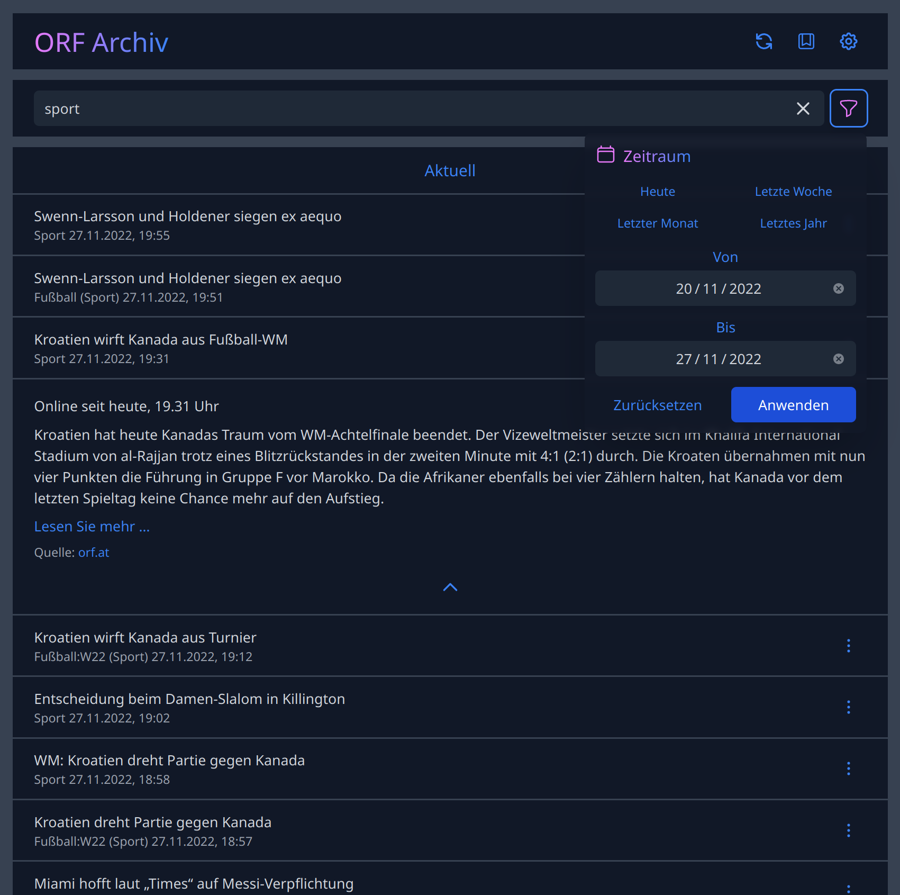

# [ORF Archiv](https://orfarchiv.news)

Web application for browsing ORF News. Stories are sorted chronologically and included sources can be configured.

## Components

Information about component details can be found in each component's README.md file.

- [DB](db/README.md): Utility for starting a _MongoDB_ instance (only required for local development)
- [Scraper](scraper/README.md): Fetches ORF News RSS feeds and persists story metadata to _MongoDB_ document store
- [UI](ui/README.md): Main web application consisting of a UI + backend.
