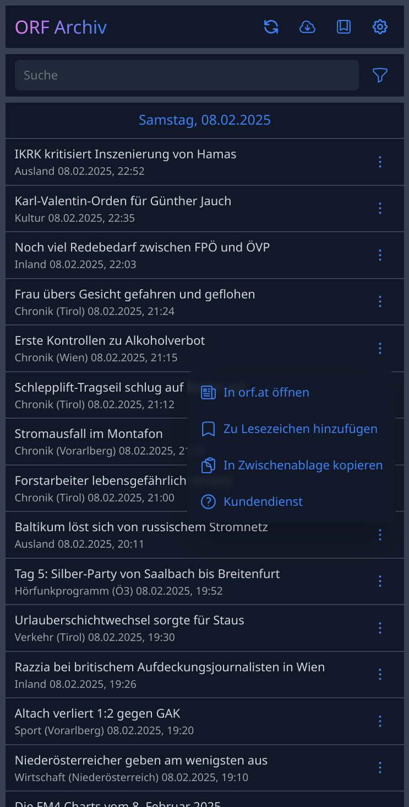

# [ORF Archiv](https://orfarchiv.news/)

Web application for browsing ORF News. Stories are sorted chronologically and included sources can be configured.

## Components

Information about component details can be found in each component's README.md file.

* [DB](db/README.md): Utility for starting a *MongoDB* instance (only required for local development)
* [Scraper](scraper/README.md): Fetches ORF News RSS feeds and persists story metadata to *MongoDB* document store
* [UI](ui/README.md): Frontend web application
